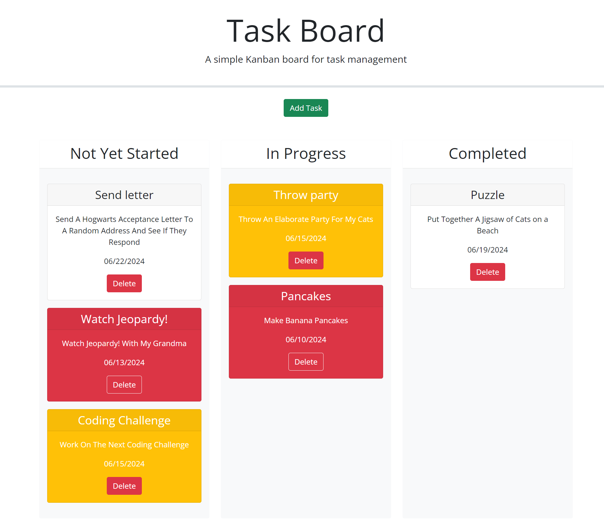

# Third-Party APIs Challenge: Task Board 

This is a simple task board application that allows a team to manage project tasks, by keeping track of due dates and progress. This app runs in the browser and feature dynamically updated HTML and CSS powered by jQuery. Day.js is used to format dates.

When the user opens the task board, a list of project tasks is displayed in columns representing the task progress state (Not Yet Started, In Progress, Completed). Each task is color coded to indicate whether it is nearing the deadline (yellow) or is overdue (red). When the user clicks on the button to add a new task, they can enter the title, description and due date for the new task into a modal form. When the user clicks the "Add Task" button, the properties for that task are saved in local Storage.

When the user drags a task to a different progress column, the task's progress state is updated accordingly and will stay in the new column after the user refreshes the page. When the user clicks the delete button for a task, the task is removed from the task board and will not be added back after the user refreshes the page.
Additionally, the saved task list persists after refreshing the page.

Link to deployed application:

Screenshots:

